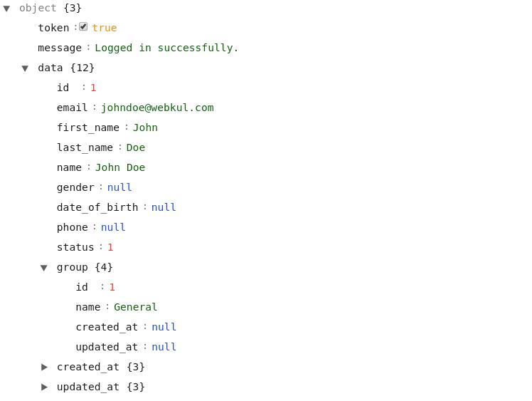

# Customers

In the customer's API: Firstly, we will look for the customer's authentication with the help of login credentials.  
Because customers can't access/add/modify their addresses, orders, reviews and wishlists without logging into the front store.  
To authenticate at the Bagisto store, the customer needs a valid email address and password.

## Customer Authentication

::: details Request example

```php
$client = new http\Client;
$request = new http\Client\Request;

$request->setRequestUrl('https://example.com/api/customer/login');
$request->setRequestMethod('POST');
$request->setQuery(new http\QueryString(array(
  'email'     => 'johndoe@webkul.com',
  'password'  => 'example123456',
)));

$client->enqueue($request)->send();
$response = $client->getResponse();

echo $response->getBody();
```
::: tip
**Note**: You have to send your data `email` and `password` using `POST HTTP verb`.
:::

::: details Response

:::

## Customer Registration

You can create/register a new customer in the Bagisto store. To achieve this task, you can use the `customer/register` API call resource.

::: details Example request
```php
$client = new http\Client;
$request = new http\Client\Request;

$request->setRequestUrl('https://example.com/api/customer/register');
$request->setRequestMethod('POST');
$request->setQuery(new http\QueryString(array(
  'email'                   => 'peter.doe@bagisto.com',
  'first_name'              => 'Peter',
  'last_name'               => 'Doe',
  'password'                => 'example123456',
  'password_confirmation'   => 'example123456',
)));

$client->enqueue($request)->send();
$response = $client->getResponse();

echo $response->getBody();
```
**Note**: In the `customer/register` resource API call, we used `POST HTTP verb` to sent the customer's information for registration.

:::

::: details Response
```json
{
    message: "Your account has been created successfully."
}
```

::: tip
In case there is already a customer in the Bagisto Store with the same email address for which you are going to create new customer, then you will get an error message in response like:

```json
{
    message: "The given data was invalid.",
    errors: {
        email: ["The email has already been taken."]
    }
}
```

:::

## Reset Password

You can also use the API to reset the customer's password by providing the valid customer's email address.  
In this API request, you have to use the `customer/forgot-password` resource with `email` as a Request Payload.  
An email will be send on the provided email address, only if the same email address exists in the Bagisto Store.


::: details Request example

```php
$client = new http\Client;
$request = new http\Client\Request;

$request->setRequestUrl('https://example.com/api/customer/forgot-password');
$request->setRequestMethod('POST');
$request->setQuery(new http\QueryString(array(
  'email'     => 'johndoe@webkul.com'
)));

$client->enqueue($request)->send();
$response = $client->getResponse();

echo $response->getBody();
```
::: tip
**Note**: You have to send your data `email` using `POST HTTP verb`.
:::

::: details Response
```json
{
    "message": "We have e-mailed your password reset link!"
}
```

::: tip 
In case you provide an invalid or unregistered email address , then no email will be send to provided email address and the response will return:

```json
{
    "error": "We can't find a user with that e-mail address."
}
```
:::


## Logout

You can use logout the customer from the Bagisto store with the help of `customer/logout` resource. No need to provide any request payload in the API call.

::: details Request example
```php
$client = new http\Client;
$request = new http\Client\Request;

$request->setRequestUrl('https://example.com/api/customer/logout');
$request->setRequestMethod('GET');

$client->enqueue($request)->send();
$response = $client->getResponse();

echo $response->getBody();
```
**Note**: The customer's `logout` API call send through `GET HTTP verb` .
:::

::: details Response
```json
{
    "message": "Logged out successfully!"
}
```
:::

## Get customer details

You can get the customer's details only for the logged in customer.  
To retrieve the customer's information you can use the `customer/get` resource.  
This API call will return you the personal details of logged in customer.

::: details Request example
```php
$client = new http\Client;
$request = new http\Client\Request;

$request->setRequestUrl('https://example.com/api/customer/get');
$request->setRequestMethod('GET');

$client->enqueue($request)->send();
$response = $client->getResponse();

echo $response->getBody();
```
**Note**: In the `customer/get` API call resource, we used `GET HTTP verb` to get the customer's profile information.
:::

::: details Response
```json
{
    "data": {
        "id": 1,
        "email": "johndoe@example.com",
        "first_name": "John",
        "last_name": "Doe",
        "name": "John Doe",
        "gender": "Male",
        "date_of_birth": null,
        "phone": null,
        "status": 1,
        "group": {
            "id": 1,
            "name": "General",
            "created_at": null,
            "updated_at": null
        },
        "created_at": {},
        "updated_at": {}
    }
}
```
:::

## Get customer details based on id

You can also get the customer information (like: `customer/get` resource) by using customer_id as a request payload. To achieve this task, you can use the `customers/{id}` API call resource.

::: details Request example
```php
$client = new http\Client;
$request = new http\Client\Request;

$request->setRequestUrl('https://example.com/api/customers/1');
$request->setRequestMethod('GET');

$client->enqueue($request)->send();
$response = $client->getResponse();

echo $response->getBody();
```
::: tip
This `customers/{id}` API call resource will return the customer's details only if the customer has logged in currently.
**Note**: In the `customers/{id}` resource API call, we used `GET HTTP verb` to get the login customer's information.
:::

::: details Response
```json
{
    "data": {
        "id": 1,
        "email": "johndoe@example.com",
        "first_name": "John",
        "last_name": "Doe",
        "name": "John Doe",
        "gender": "Male",
        "date_of_birth": null,
        "phone": null,
        "status": 1,
        "group": {
            "id": 1,
            "name": "General",
            "created_at": null,
            "updated_at": null
        },
        "created_at": {},
        "updated_at": {}
    }
}
```
:::

## Modify Customer's Profile Details: <a id="modify-customer-profile"></a>

You can update the customer's account information (only for the currently logged-in customer).  
To achieve this task, you can use the `customer/profile` API call resource.  
This API call will return you the personal details of login customer.

> _https://example.com/public/api/customer/profile_


::: details Request
```json
{
    id: 1
    first_name: "John"
    last_name: "Doe"
    name: "John Doe"
    email: "johndoe@example.com"
    password: "******"
    password_confirmation: "******"
    gender: "Male"
    group: {...}
    date_of_birth: null
    phone: null
    status: 1
    created_at: {...}
    updated_at: {...}
}
```
**Note**: _In the `customer/profile` resource API call, we used `PUT HTTP verb` to sent the customer's profile information for update._
:::

::: details Response
```json
{
    "message": "Your account has been updated successfully.",
    "data": {
        id: 1
        first_name: "John",
        last_name: "Doe",
        name: "John Doe",
        email: "johndoe@example.com"
        phone: null,
        status: 1
    }
}
```
:::