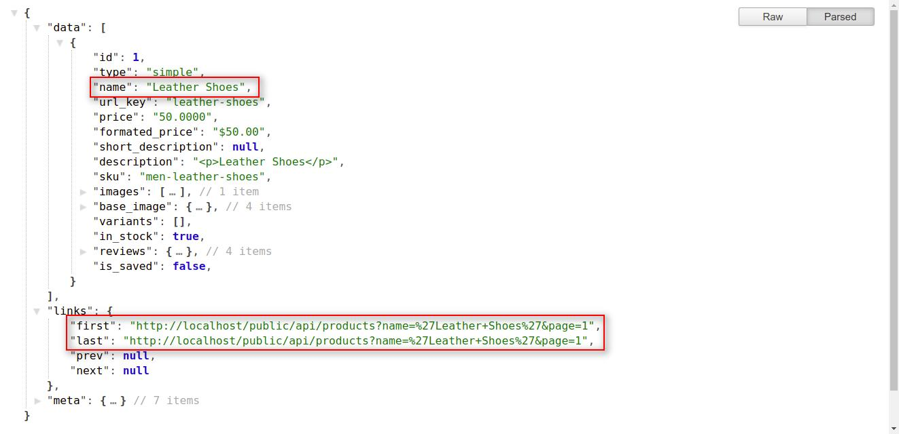

# Products

To get all the products you have to place a request by using the API endpoint `products`.

::: details Request Example
```php
$url = "https://example.com/api/products";
$ch = curl_init();

curl_setopt($ch, CURLOPT_URL, $url);
// Prevent cURL from trying to verify the SSL certificate (only in dev environments)
curl_setopt($ch,CURLOPT_SSL_VERIFYPEER, FALSE);

curl_setopt($ch, CURLOPT_RETURNTRANSFER, 1);

$output = curl_exec($ch);
$data   = json_decode($output);

curl_close($ch);

print_r($data);
```
:::

::: details Response
```json
{
  "data": [
    {
      "id": 3,
      "type": "simple",
      "name": "Lenovo IdeaPad Yoga 500 15 Hybrid (2-in-1) White",
      "url_key": "lenovo-ideapad-yoga-500-15-hybrid-2-in-1-white",
      "price": "600.0000",
      "formated_price": "$600.00",
      "short_description": "<p>Intel Core i7-6500U Processor (4M Cache, up to 3.10 GHz), 8GB RAM, 1000GB HDD, 14.0\" FHD (1920x1080) MT, Intel HD Graphics 520 + NVIDIA GeForce 940M, Windows 10 Home 64</p>",
      "description": "<p><strong class=\"tip-anchor tip-anchor-text tip-anchor-wrap\">Lenovo IdeaPad Yoga 500 15 Hybrid (2-in-1) White 15.6\" 1920 x 1080 pixels Touchscreen 6th gen Intel&reg; Core&trade; i7 8 GB DDR3L-SDRAM 1000 GB HDD NVIDIA&reg; GeForce&reg; GT 940M Windows 10 Home: </strong></p>\r\n<p class=\"description prod_long_description\"><strong>360&ordm; Flip-and-Fold Design</strong><br /> A PC when you need it, a tablet when you want it, and more. Easily change between four modes &mdash; Laptop, Stand, Tent, and Tablet. The secret: Yoga 500's unique design and touchscreen display. It allows the screen to flip around 360&ordm;, which means you can select the mode you use based on what you choose to Do.<br /> <br /> <strong>Performance for Work and Play</strong><br /> With the latest Intel&reg; Core&trade; i Series processors, you have the power to play, create, entertain, or inspire. Enjoy powerful performance and vibrant visuals to multitask with ease, amazing battery life to keep up with you, and built-in security features to help keep your data safer.<br /> <br /> <strong>Up to Windows 8.1</strong><br /> Built for business. Built for life. Windows 8.1 brings together everything you do across all your devices &mdash; whether at home, at work, or on the go.<br /> <br /> <strong>Ultra Thin, Light, &amp; Portable</strong><br /> Starting at a mere 4.3 lbs and just 2.15cm (0.85) thin, the Yoga 500 is ultra portable &mdash; it's perfect for doers on the go. And with up to 8 hours on a standard battery, you can go all day without recharging.<br /> <br /> <strong>Harmony</strong><br /> Lenovo Harmony adapts to you by intuitively optimizing settings, making app recommendations by mode, and sharing statistics about how you use your device.<br /> <br /> <strong>Stereo Speakers With Dolby&reg; Home Theater&reg;</strong><br /> The Yoga 500's speakers deliver rich stereo sound, while Dolby&reg; Home Theater&reg; provides an immersive audio experience.<br /> <br /> <strong>McAfee LiveSafe&reg; Free Trial</strong><br /> Keep your entire digital life secure with the comprehensive protection afforded by McAfee LiveSafe software. LiveSafe protects cross-device, through the cloud, and locally to ensure total security for your data and identity. Enjoy a free 30-day trial with purchase. Or, upgrade to the full version during the purchase process and enjoy peace-of-mind security from day one.<br /> <br /> <strong>Lenovo DOit Apps</strong><br /> Do more with your Yoga 500 with premium Lenovo applications like SHAREit, which lets you share files quickly without network charges or a WiFi connection; and SYNCit, which backs up and restores your contacts and SMSs.</p>",
      "sku": "5626",
      "images": [
        {
          "id": 4,
          "path": "product/3/X95JzibrJRttMK2anYdryf2lsvBjDTkuVitV3go8.jpeg",
          "url": "https://example.com/storage/product/3/X95JzibrJRttMK2anYdryf2lsvBjDTkuVitV3go8.jpeg",
          "original_image_url": "https://example.com/storage/product/3/X95JzibrJRttMK2anYdryf2lsvBjDTkuVitV3go8.jpeg",
          "small_image_url": "https://example.com/cache/small/product/3/X95JzibrJRttMK2anYdryf2lsvBjDTkuVitV3go8.jpeg",
          "medium_image_url": "https://example.com/cache/medium/product/3/X95JzibrJRttMK2anYdryf2lsvBjDTkuVitV3go8.jpeg",
          "large_image_url": "https://example.com/cache/large/product/3/X95JzibrJRttMK2anYdryf2lsvBjDTkuVitV3go8.jpeg"
        }
      ],
      "base_image": {
        "small_image_url": "https://example.com/cache/small/product/3/X95JzibrJRttMK2anYdryf2lsvBjDTkuVitV3go8.jpeg",
        "medium_image_url": "https://example.com/cache/medium/product/3/X95JzibrJRttMK2anYdryf2lsvBjDTkuVitV3go8.jpeg",
        "large_image_url": "https://example.com/cache/large/product/3/X95JzibrJRttMK2anYdryf2lsvBjDTkuVitV3go8.jpeg",
        "original_image_url": "https://example.com/cache/original/product/3/X95JzibrJRttMK2anYdryf2lsvBjDTkuVitV3go8.jpeg"
      },
      "variants": [],
      "in_stock": true,
      "reviews": {
        "total": 0,
        "total_rating": 0,
        "average_rating": 0,
        "percentage": []
      },
      "is_saved": false,
      "created_at": "2020-09-09 03:31:47",
      "updated_at": "2020-09-09 03:31:47"
    }
  ],
  "links": {
    "first": "https://example.com/api/products?page=1",
    "last": "https://example.com/api/products?page=1",
    "prev": null,
    "next": null
  },
  "meta": {
    "current_page": 1,
    "from": 1,
    "last_page": 1,
    "path": "https://example.com/api/products",
    "per_page": 9,
    "to": 3,
    "total": 3
  }
}
```
:::

## Get Products With Pagination

::: details Request Example
```php
$url = "https://example.com/api/products?page=1";
$ch  = curl_init();

curl_setopt($ch, CURLOPT_URL, $url);
// Prevent cURL from trying to verify the SSL certificate (only in dev environments)
curl_setopt($ch,CURLOPT_SSL_VERIFYPEER, FALSE);

curl_setopt($ch, CURLOPT_RETURNTRANSFER, 1);

$output = curl_exec($ch);
$data   = json_decode($output);

curl_close($ch);

print_r($data);
```

::: tip
 If you didn't use the page(?page=x) filter, then it returns the data of the first page by default.
:::


::: details Response
```json
{
  "data": [
    {
      "id": 3,
      "type": "simple",
      "name": "Lenovo IdeaPad Yoga 500 15 Hybrid (2-in-1) White",
      "url_key": "lenovo-ideapad-yoga-500-15-hybrid-2-in-1-white",
      "price": "600.0000",
      "formated_price": "$600.00",
      "short_description": "<p>Intel Core i7-6500U Processor (4M Cache, up to 3.10 GHz), 8GB RAM, 1000GB HDD, 14.0\" FHD (1920x1080) MT, Intel HD Graphics 520 + NVIDIA GeForce 940M, Windows 10 Home 64</p>",
      "description": "<p><strong class=\"tip-anchor tip-anchor-text tip-anchor-wrap\">Lenovo IdeaPad Yoga 500 15 Hybrid (2-in-1) White 15.6\" 1920 x 1080 pixels Touchscreen 6th gen Intel&reg; Core&trade; i7 8 GB DDR3L-SDRAM 1000 GB HDD NVIDIA&reg; GeForce&reg; GT 940M Windows 10 Home: </strong></p>\r\n<p class=\"description prod_long_description\"><strong>360&ordm; Flip-and-Fold Design</strong><br /> A PC when you need it, a tablet when you want it, and more. Easily change between four modes &mdash; Laptop, Stand, Tent, and Tablet. The secret: Yoga 500's unique design and touchscreen display. It allows the screen to flip around 360&ordm;, which means you can select the mode you use based on what you choose to Do.<br /> <br /> <strong>Performance for Work and Play</strong><br /> With the latest Intel&reg; Core&trade; i Series processors, you have the power to play, create, entertain, or inspire. Enjoy powerful performance and vibrant visuals to multitask with ease, amazing battery life to keep up with you, and built-in security features to help keep your data safer.<br /> <br /> <strong>Up to Windows 8.1</strong><br /> Built for business. Built for life. Windows 8.1 brings together everything you do across all your devices &mdash; whether at home, at work, or on the go.<br /> <br /> <strong>Ultra Thin, Light, &amp; Portable</strong><br /> Starting at a mere 4.3 lbs and just 2.15cm (0.85) thin, the Yoga 500 is ultra portable &mdash; it's perfect for doers on the go. And with up to 8 hours on a standard battery, you can go all day without recharging.<br /> <br /> <strong>Harmony</strong><br /> Lenovo Harmony adapts to you by intuitively optimizing settings, making app recommendations by mode, and sharing statistics about how you use your device.<br /> <br /> <strong>Stereo Speakers With Dolby&reg; Home Theater&reg;</strong><br /> The Yoga 500's speakers deliver rich stereo sound, while Dolby&reg; Home Theater&reg; provides an immersive audio experience.<br /> <br /> <strong>McAfee LiveSafe&reg; Free Trial</strong><br /> Keep your entire digital life secure with the comprehensive protection afforded by McAfee LiveSafe software. LiveSafe protects cross-device, through the cloud, and locally to ensure total security for your data and identity. Enjoy a free 30-day trial with purchase. Or, upgrade to the full version during the purchase process and enjoy peace-of-mind security from day one.<br /> <br /> <strong>Lenovo DOit Apps</strong><br /> Do more with your Yoga 500 with premium Lenovo applications like SHAREit, which lets you share files quickly without network charges or a WiFi connection; and SYNCit, which backs up and restores your contacts and SMSs.</p>",
      "sku": "5626",
      "images": [
        {
          "id": 4,
          "path": "product/3/X95JzibrJRttMK2anYdryf2lsvBjDTkuVitV3go8.jpeg",
          "url": "https://example.com/storage/product/3/X95JzibrJRttMK2anYdryf2lsvBjDTkuVitV3go8.jpeg",
          "original_image_url": "https://example.com/storage/product/3/X95JzibrJRttMK2anYdryf2lsvBjDTkuVitV3go8.jpeg",
          "small_image_url": "https://example.com/cache/small/product/3/X95JzibrJRttMK2anYdryf2lsvBjDTkuVitV3go8.jpeg",
          "medium_image_url": "https://example.com/cache/medium/product/3/X95JzibrJRttMK2anYdryf2lsvBjDTkuVitV3go8.jpeg",
          "large_image_url": "https://example.com/cache/large/product/3/X95JzibrJRttMK2anYdryf2lsvBjDTkuVitV3go8.jpeg"
        }
      ],
      "base_image": {
        "small_image_url": "https://example.com/cache/small/product/3/X95JzibrJRttMK2anYdryf2lsvBjDTkuVitV3go8.jpeg",
        "medium_image_url": "https://example.com/cache/medium/product/3/X95JzibrJRttMK2anYdryf2lsvBjDTkuVitV3go8.jpeg",
        "large_image_url": "https://example.com/cache/large/product/3/X95JzibrJRttMK2anYdryf2lsvBjDTkuVitV3go8.jpeg",
        "original_image_url": "https://example.com/cache/original/product/3/X95JzibrJRttMK2anYdryf2lsvBjDTkuVitV3go8.jpeg"
      },
      "variants": [],
      "in_stock": true,
      "reviews": {
        "total": 0,
        "total_rating": 0,
        "average_rating": 0,
        "percentage": []
      },
      "is_saved": false,
      "created_at": "2020-09-09 03:31:47",
      "updated_at": "2020-09-09 03:31:47"
    },
    {
      "id": 2,
      "type": "simple",
      "name": "DELL Inspiron 5486 Hybrid (2-in-1) Black",
      "url_key": "dell-inspiron-5486-hybrid-2-in-1-black",
      "price": "919.3100",
      "formated_price": "$919.31",
      "short_description": "<p>DELL Inspiron 5486 Hybrid (2-in-1) Black, Gray 14\" 1920 x 1080 pixels Touchscreen 8th gen Intel&reg; Core&trade; i5 8 GB DDR4-SDRAM 256 GB SSD NVIDIA&reg; GeForce&reg; MX130 Wi-Fi 5 (802.11ac) Windows 10 Home</p>",
      "description": "<p>DELL Inspiron 5486. Product type: Hybrid (2-in-1), Form factor: Convertible (Folder). Processor family: 8th gen Intel&reg; Core&trade; i5, Processor model: i5-8265U, Processor frequency: 1.6 GHz. Display diagonal: 14\", Display resolution: 1920 x 1080 pixels, Touchscreen. Internal memory: 8 GB, Internal memory type: DDR4-SDRAM. Total storage capacity: 256 GB, Storage media: SSD. On-board graphics adapter model: Intel&reg; UHD Graphics 620. Operating system installed: Windows 10 Home. Product color: Black, Gray</p>",
      "sku": "5542",
      "images": [
        {
          "id": 3,
          "path": "product/2/eEG6a1qnbXFKLS2mQmjQrdAHKEsYC4ygxZhi2MWf.jpeg",
          "url": "https://example.com/storage/product/2/eEG6a1qnbXFKLS2mQmjQrdAHKEsYC4ygxZhi2MWf.jpeg",
          "original_image_url": "https://example.com/storage/product/2/eEG6a1qnbXFKLS2mQmjQrdAHKEsYC4ygxZhi2MWf.jpeg",
          "small_image_url": "https://example.com/cache/small/product/2/eEG6a1qnbXFKLS2mQmjQrdAHKEsYC4ygxZhi2MWf.jpeg",
          "medium_image_url": "https://example.com/cache/medium/product/2/eEG6a1qnbXFKLS2mQmjQrdAHKEsYC4ygxZhi2MWf.jpeg",
          "large_image_url": "https://example.com/cache/large/product/2/eEG6a1qnbXFKLS2mQmjQrdAHKEsYC4ygxZhi2MWf.jpeg"
        }
      ],
      "base_image": {
        "small_image_url": "https://example.com/cache/small/product/2/eEG6a1qnbXFKLS2mQmjQrdAHKEsYC4ygxZhi2MWf.jpeg",
        "medium_image_url": "https://example.com/cache/medium/product/2/eEG6a1qnbXFKLS2mQmjQrdAHKEsYC4ygxZhi2MWf.jpeg",
        "large_image_url": "https://example.com/cache/large/product/2/eEG6a1qnbXFKLS2mQmjQrdAHKEsYC4ygxZhi2MWf.jpeg",
        "original_image_url": "https://example.com/cache/original/product/2/eEG6a1qnbXFKLS2mQmjQrdAHKEsYC4ygxZhi2MWf.jpeg"
      },
      "variants": [],
      "in_stock": true,
      "reviews": {
        "total": 0,
        "total_rating": 0,
        "average_rating": 0,
        "percentage": []
      },
      "is_saved": false,
      "created_at": "2020-09-09 03:05:20",
      "updated_at": "2020-09-09 03:05:20"
    },
    {
      "id": 1,
      "type": "simple",
      "name": "Adorable Cream Teddy Bear",
      "url_key": "adorable-cream-teddy-bear",
      "price": "10.0000",
      "formated_price": "$10.00",
      "short_description": "<p>Buy Adorable Cream Teddy Bear online at best price</p>",
      "description": "<p>Buy Adorable Cream Teddy Bear online at best price</p>",
      "sku": "80971254",
      "images": [
        {
          "id": 1,
          "path": "product/1/dq6dLYcw2zkOjFyKoCk0IYwuljVvtwiEGrVHxaCG.jpeg",
          "url": "https://example.com/storage/product/1/dq6dLYcw2zkOjFyKoCk0IYwuljVvtwiEGrVHxaCG.jpeg",
          "original_image_url": "https://example.com/storage/product/1/dq6dLYcw2zkOjFyKoCk0IYwuljVvtwiEGrVHxaCG.jpeg",
          "small_image_url": "https://example.com/cache/small/product/1/dq6dLYcw2zkOjFyKoCk0IYwuljVvtwiEGrVHxaCG.jpeg",
          "medium_image_url": "https://example.com/cache/medium/product/1/dq6dLYcw2zkOjFyKoCk0IYwuljVvtwiEGrVHxaCG.jpeg",
          "large_image_url": "https://example.com/cache/large/product/1/dq6dLYcw2zkOjFyKoCk0IYwuljVvtwiEGrVHxaCG.jpeg"
        }
      ],
      "base_image": {
        "small_image_url": "https://example.com/cache/small/product/1/dq6dLYcw2zkOjFyKoCk0IYwuljVvtwiEGrVHxaCG.jpeg",
        "medium_image_url": "https://example.com/cache/medium/product/1/dq6dLYcw2zkOjFyKoCk0IYwuljVvtwiEGrVHxaCG.jpeg",
        "large_image_url": "https://example.com/cache/large/product/1/dq6dLYcw2zkOjFyKoCk0IYwuljVvtwiEGrVHxaCG.jpeg",
        "original_image_url": "https://example.com/cache/original/product/1/dq6dLYcw2zkOjFyKoCk0IYwuljVvtwiEGrVHxaCG.jpeg"
      },
      "variants": [],
      "in_stock": true,
      "reviews": {
        "total": 0,
        "total_rating": 0,
        "average_rating": 0,
        "percentage": []
      },
      "is_saved": false,
      "created_at": "2020-09-09 01:52:02",
      "updated_at": "2020-09-09 01:52:02"
    }
  ],
  "links": {
    "first": "https://example.com/api/products?page=1",
    "last": "https://example.com/api/products?page=1",
    "prev": null,
    "next": null
  },
  "meta": {
    "current_page": 1,
    "from": 1,
    "last_page": 1,
    "path": "https://example.com/api/products",
    "per_page": 9,
    "to": 3,
    "total": 3
  }
}
```
::: 

### Explanation

In the response above, you will find the three Objects with the indexes mentioned below:
  1. data
  2. link
  3. meta

#### Data Object: <a id="data-object"></a>

Under the data object, you will find the collection of many objects containing the details of bagisto store's products. You can use the product's index data by accessing these products sub-objects.

**Note**: _Regarding link and meta objects, we already explained these objects functionality in_ <a href="api_category.html#link-object" target="_blank" class="bagsito-link"> _Category API_ </a> _section_.

### 1.1. Get Product(s) With Query Parameters: <a id="get-product-with-query-parameters"></a>

- <span class="bagsito-link">category_id</span> : You can find out the store products based on any specific category. You can achieve this task by just passing **`category_id`** as the query parameter in API url. **For example: `category_id=1`**

> _https://example.com/public/api/products?category_id=2_

```
* You can also use the limit and page query parameters with the category_id parameter.
```

> _https://example.com/public/api/products?category_id=2&limit=5&page=1_

> _https://example.com/public/api/products?category_id=2&limit=5&page=1_

{:class="screenshot-dimension center"}

- <span class="bagsito-link">new</span> : If you want to get the store's product(s) those are having new condition then you can use **`new=1`** in the query parameter and if want to get product(s) without new condition then use **`new=0`**.

> _https://example.com/public/api/products?new=1_

```
* You can also use the limit and page query parameters with the new query parameter:
```

> _https://example.com/public/api/products?new=1&limit=5&page=1_

> _https://example.com/public/api/products?new=0&limit=5&page=1_

{:class="screenshot-dimension center"}

- <span class="bagsito-link">featured</span> : If you want to get the store's product(s) those are featured then you can use **`featured=1`** query parameter and use **`featured=0`** for vice-versa.

> _https://example.com/public/api/products?featured=1_

```
* You can also use the limit and page in query parameters with featured query parameter:
```

> _https://example.com/public/api/products?featured=1&limit=5&page=1_

> _https://example.com/public/api/products?featured=0&limit=5&page=1_

{:class="screenshot-dimension center"}

- <span class="bagsito-link">name</span> : Suppose you want to find out the data of your product in the Bagisto store, here you can use **`name` query parameter**. You have to provide the product name to the **`name`** query parameter in API url. **For example: `name=<product-name>`**

> _https://example.com/public/api/products?name='Leather Shoes'_

{:class="screenshot-dimension center"}

- <span class="bagsito-link">sku</span> : You can also get your product related details with the help of product's sku. Sku will be unique for each product in Bagisto Store. For this you have to use **`sku`** as query parameter in API url. **For example: `sku=<product-sku>`**

> _https://example.com/public/api/products?name='Leather Shoes'_

{:class="screenshot-dimension center"}

- <span class="bagsito-link">url_key</span> : **`url_key`** is a unique field for every product in Bagisto Store. You can also find out product details by using **`url_key`**. For this you have to pass `url_key` as query parameter in API url. **For example: `url_key=<product-url-key>`**

> _https://example.com/public/api/products?url_key='leather-shoes'_

{:class="screenshot-dimension center"}

### 1.2. Get Product(s) With Filterable Query Parameters: <a id="get-product-with-filter-parameters"></a>

You can also filter your store product(s) by using **`filterable attributes query parameters`**. These filter will only work with the **`category_id`** input query parameter. There are two system defined filterable attributes in the Bagisto E-commerce framework i.e. **`Size`** and **`Color`**. Admin user can also create their own **`Custom Attribute`** and can make these custom attributes as **`filterable`**. By using these filterable attributes, customer can filter the category's product(s) to get the desired result.

- <span class="bagsito-link">size</span> : You can filter bagisto product catalog with the help of `size` filter. `size` filter will work only on the category layout. You can pass the multiple attribute's values to the `size` filterable attributes as a query parameter in API url. Suppose you want to filter **`Men's T-Shirt`** with **`M and L size`**, then you can pass the value of both M & L. **For Example: `size=6,7`**

> _https://example.com/public/api/products?category_id=2&size=6,7_

```
* You can also use the limit and page in query parameters with category & size filterable parameters:
```

> _https://example.com/public/api/products?category_id=2&size=6,7&limit=10&page=1_

{:class="screenshot-dimension center"}

- <span class="bagsito-link">color</span> : You can also filter bagisto product catalog with the help of `color` filter. `color` filter will work only on the category layout. You can pass the multiple attribute's values to the `color` filterable attributes as a query parameter in API url. Suppose you want to filter **`Men's T-Shirt`** with **`White and Red color`**, then you can pass the value of both White & Red. **For Example: `color=1,2`**

> _https://example.com/public/api/products?category_id=2&color=1,2_

```
* You can also use the limit and page in query parameters with category & color filterable parameters:
```

> _https://example.com/public/api/products?category_id=2&color=1,2&limit=10&page=1_

{:class="screenshot-dimension center"}

- <span class="bagsito-link">price</span> : You can also filter bagisto product catalog with the help of `price` filter.

#### In case of simple product: <a id="simple-product"></a>

- You can set range of a minimum price and maximum price. Same like **`size and color`**, `price` filter will also work on the category layout only. Suppose you want to filter product(s) those are having price between price range from 50 to 100, then you have to pass value like: **`price=10,50`** as the query parameter in API url.

> _https://example.com/public/api/products?category_id=2&price=50,100_

```
* You can also use the limit and page in query parameters with category & price filterable parameters:
```

> _https://example.com/public/api/products?category_id=2&price=50,100&limit=10&page=1_

{:class="screenshot-dimension center"}

#### In case of configurable product: <a id="configurable-product"></a>

- **`price`** filter will also work with product's variants. Suppose you want to filter product(s) with the **`40$ min and 100$ max`** price range. And there is configurable product named **`Men's T-shirts`** having price **`30$`** and there is any variant of same product having `45$ price`, then **`Men's T-shirts`** product will show you in the filtered product's list. For Example: **`price=30,100`**.

> _https://example.com/public/api/products?category_id=2&price=30,100_

{:class="screenshot-dimension center"}

**Note**: _The above explained `filter query parameters` (i.e. size,color,price) can be use together_.

## Get Specific Product: <a id="get-specific-product"></a>

If you want the record of any specific product, then you have to provide the product id as as input parameter in API url.

::: details Request Example
```php
$url = "https://example.com/public/api/products/1";
$ch  = curl_init();

curl_setopt($ch, CURLOPT_URL, $url);
// Prevent cURL from trying to verify the SSL certificate (only in dev environments)
curl_setopt($ch,CURLOPT_SSL_VERIFYPEER, FALSE);

curl_setopt($ch, CURLOPT_RETURNTRANSFER, 1);

$output = curl_exec($ch);
$data   = json_decode($output);

curl_close($ch);

print_r($data);
```
:::

**Note**: Here you will see in the API response `data Object` will only contain the single object of category record.
::: details Response
```json
{
  "data": {
    "id": 1,
    "type": "simple",
    "name": "Adorable Cream Teddy Bear",
    "url_key": "adorable-cream-teddy-bear",
    "price": "10.0000",
    "formated_price": "$10.00",
    "short_description": "<p>Buy Adorable Cream Teddy Bear online at best price</p>",
    "description": "<p>Buy Adorable Cream Teddy Bear online at best price</p>",
    "sku": "80971254",
    "images": [
      {
        "id": 1,
        "path": "product/1/dq6dLYcw2zkOjFyKoCk0IYwuljVvtwiEGrVHxaCG.jpeg",
        "url": "https://example.com/storage/product/1/dq6dLYcw2zkOjFyKoCk0IYwuljVvtwiEGrVHxaCG.jpeg",
        "original_image_url": "https://example.com/storage/product/1/dq6dLYcw2zkOjFyKoCk0IYwuljVvtwiEGrVHxaCG.jpeg",
        "small_image_url": "https://example.com/cache/small/product/1/dq6dLYcw2zkOjFyKoCk0IYwuljVvtwiEGrVHxaCG.jpeg",
        "medium_image_url": "https://example.com/cache/medium/product/1/dq6dLYcw2zkOjFyKoCk0IYwuljVvtwiEGrVHxaCG.jpeg",
        "large_image_url": "https://example.com/cache/large/product/1/dq6dLYcw2zkOjFyKoCk0IYwuljVvtwiEGrVHxaCG.jpeg"
      }
    ],
    "base_image": {
      "small_image_url": "https://example.com/cache/small/product/1/dq6dLYcw2zkOjFyKoCk0IYwuljVvtwiEGrVHxaCG.jpeg",
      "medium_image_url": "https://example.com/cache/medium/product/1/dq6dLYcw2zkOjFyKoCk0IYwuljVvtwiEGrVHxaCG.jpeg",
      "large_image_url": "https://example.com/cache/large/product/1/dq6dLYcw2zkOjFyKoCk0IYwuljVvtwiEGrVHxaCG.jpeg",
      "original_image_url": "https://example.com/cache/original/product/1/dq6dLYcw2zkOjFyKoCk0IYwuljVvtwiEGrVHxaCG.jpeg"
    },
    "variants": [],
    "in_stock": true,
    "reviews": {
      "total": 0,
      "total_rating": 0,
      "average_rating": 0,
      "percentage": []
    },
    "is_saved": false,
    "created_at": "2020-09-08T23:52:02.000000Z",
    "updated_at": "2020-09-08T23:52:02.000000Z"
  }
}
```
:::


## Get Product's Additional Information

`Additional Information` relates all the attributes and their values for which Admin set the `'Yes'` value for the **`Visible on Product View Page on Front-end`** field.

Product's additional information means those attributes which describes the product's specification.


By using this API call, you will get all the attributes (both system defined and custom) of a product those are having `'Yes'` value for the **`Visible on Product View Page on Front-end`** field by providing `product_id` of that product in the API url.

_https://example.com/public/api/product-additional-information/1_

    {
        "data": [
            {
                "code": "description",
                "label": "Description",
                "value": "<p>Men's T-shirts</p>",
                "admin_name": "Description"
            }
        ]
    }


## Get Product's Variants Information

You can get all the configurable attributes of a product by using `product-configurable-config` resource in API call. It will return all the variants of a product with their `label`, `options`, `regular_price` and `final_price` also.

Admin can set the `'Yes'` value for the **`Use To Create Configurable Product`** field under the attribute panel to make that attribute as variant.

{:class="screenshot-dimension center"}

By using this API call, you will get all the configurable attributes (both system defined and custom) of a product those are having `'Yes'` value for the **`Use To Create Configurable Product`** field by providing `product_id` of that product in the API url.

_https://example.com/public/api/product-configurable-config/1_
```json
{
    "data": {
        "attributes": [
            {
                "id": 24,
                "code": "size",
                "label": "Size",
                "swatch_type": null,
                "options": [
                    {
                        "id": 7,
                        "label": "M",
                        "swatch_value": null,
                        "products": [
                            4
                        ]
                    }
                ]
            }
        ],
        "variant_prices": {
            "4": {
                "regular_price": {
                    "formated_price": "$45.00",
                    "price": 45
                },
                "final_price": {
                    "formated_price": "$45.00",
                    "price": 45
                }
            }
        }
    }
}
```
{:class="screenshot-dimension center"}