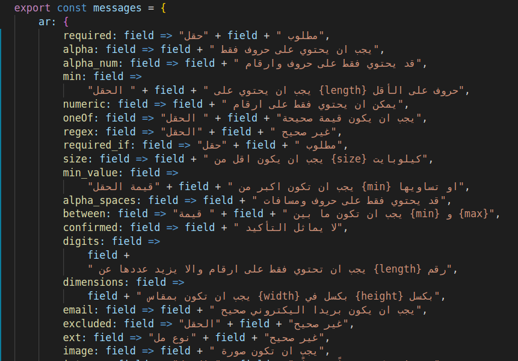

# Translations

## Modify the admin translations
You can modify the translations for the admin package by publishing them, execute the following command 
```sh
php artisan vendor:publish
```
Once this is done you should see the translations in `resources/lang/vendor/webkul/admin`.

## Change the language of error validations on your store

If you want to make your website easily accessible to customers in multiple languages and expand your business to a global level, then language translation is imperative for your website.  

This will help you get more traffic and further generate sales.  

By using language translation in Bagisto, you can easily localize your website for many global or regional languages.  

Your customer can easily translate your whole website just by a single click which also plays a major role in website SEO in the respective region and to show validation messages as per your locale, you need to follow these below steps:

### Steps to change the language of error validation

1. Within Shop package, go to src/Resources/assets/js/lang/locales.js
2. define your error translation for your locale code as shown below in the screenshot



3. Now, within **app.js**, add `ar: { messages: locales.messages.ar }` for your locale code in dictionary property such as ar for arabic

```javascript
Vue.use(VeeValidate, {
    dictionary: {
       ar: { messages: locales.messages.ar }
    }
});
```